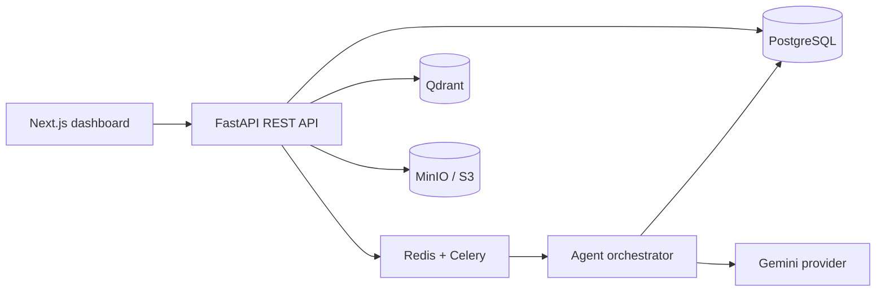

# Forgeway AI Startup Builder

Turn one sentence into a launch-ready startup workspace.

## Quick start

```powershell
cd apps/backend
python -m venv .venv
.\.venv\Scripts\Activate.ps1
pip install -r requirements.txt
uvicorn app.main:app --reload --port 8000
```

In another terminal:

```powershell
cd apps/frontend
npm install
npm run dev
```

Open http://localhost:3000. The app uses a deterministic demo provider by default, so no API key is required.
Set `AI_PROVIDER=gemini` and `GEMINI_API_KEY=...` to use Gemini for generation. Project state is currently process-local; the retry endpoint can restart failed generation while durable storage is added.

## Production architecture



See `docs/` for architecture, API, database, deployment, and example output.
