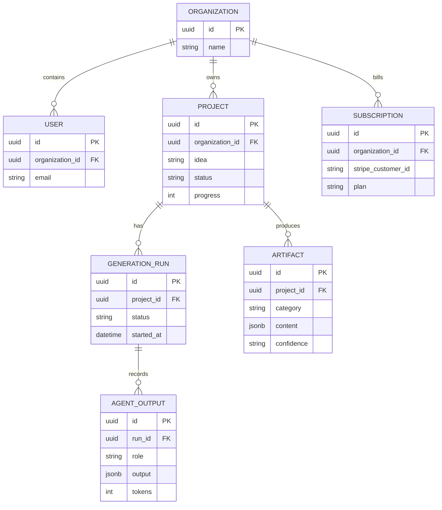

# Database schema

Recommended indexes: `project(organization_id, created_at desc)`, `artifact(project_id, category, version desc)`, `generation_run(project_id, created_at desc)`, and a unique idempotency key per generation run.
